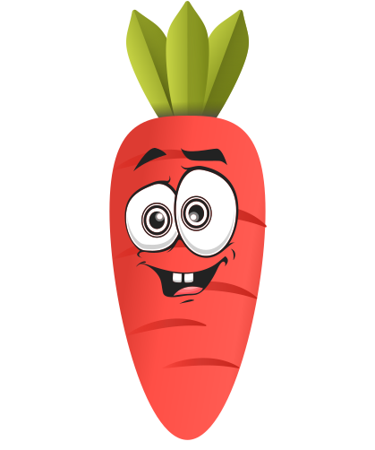
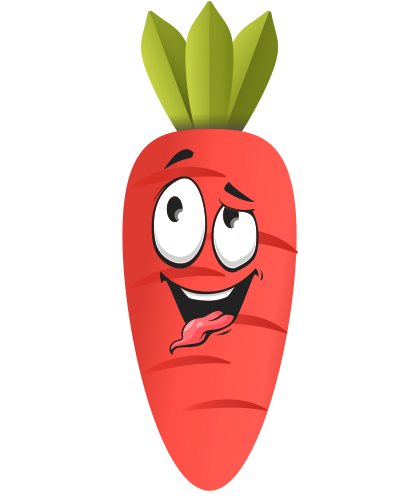
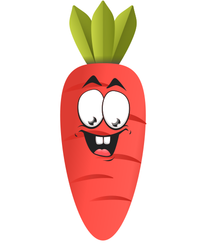
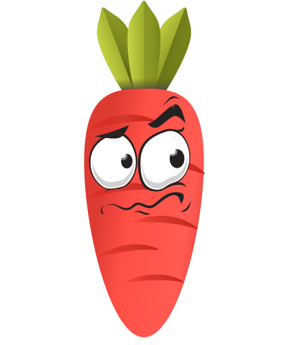
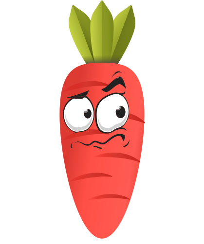
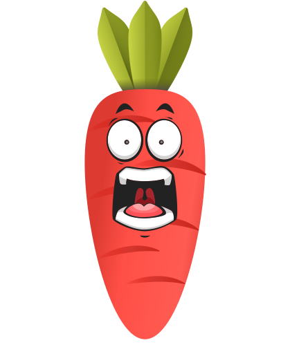

<h2 align="center"><b>Lara</b>Recipes HTML</h2>

Lara Recipes is a Laravel tutorial created by
            <a href="https://mkwsra.com" class="text-dark">Mo Kawsara</a>
            using the <a href="https://templatemo.com/tm-553-xtra-blog">Xtra Blog</a> html5 theme as a
            foundation, this theme got tweaked for the purposes of this tutorial.

## Repo Purpose

Here is the HTML version of this tutorial. Please clone it or download it in order to start your coding tutorial

OR if you wish to use it with other backend or for other purposes as Recipes Bootstrap 5 template

## About

This is a recipes HTML bootstrap template, consists of around 7 pages:

* Home page
* Categories index
* Categories show
* Recipes index
* Recipes show
* Contact Us
* FAQ
* Terms

#### Home

#### Categories Hero

#### Categories

#### Single Category

#### Single Recipe

#### Contact

#### Footer

## Lara the carrot

     

## License

As stated by [TemplateMo](https://templatemo.com/tm-553-xtra-blog) and I quote:
> Xtra Blog Template is 100% free to download for anyone. You are allowed to download, edit and use this Xtra Blog HTML
> CSS layout for your commercial or non-commercial sites. Please share Xtra Blog Template to your friends. Thank you.

##

<i>❤️ Go code something great my friend 💪</i>

